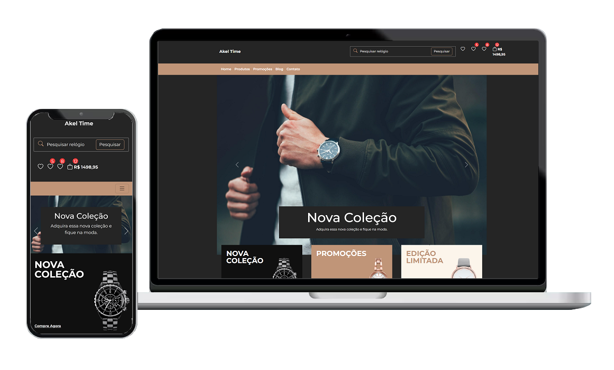

# Sobre o Projeto Bootstrap5-Ecommerce

O projeto trata-se da criação de um layout E-Commerce durante a realização do curso online, **[Bootstrap 5 do básico ao avançado](https://www.udemy.com/course/bootstrap-5-do-basico-ao-avancado-com-4-projetos/)**, qual este template foi utilizado como práticas dos conhecimentos ensinados nas aulas. 

### Templates
- Home [IMG](img/outros/home.jpg)

## Tecnologias utilizadas

- **[Bootstrap 5](https://getbootstrap.com/)**

## Licença

A licença MIT foi aplicada ao projeto.